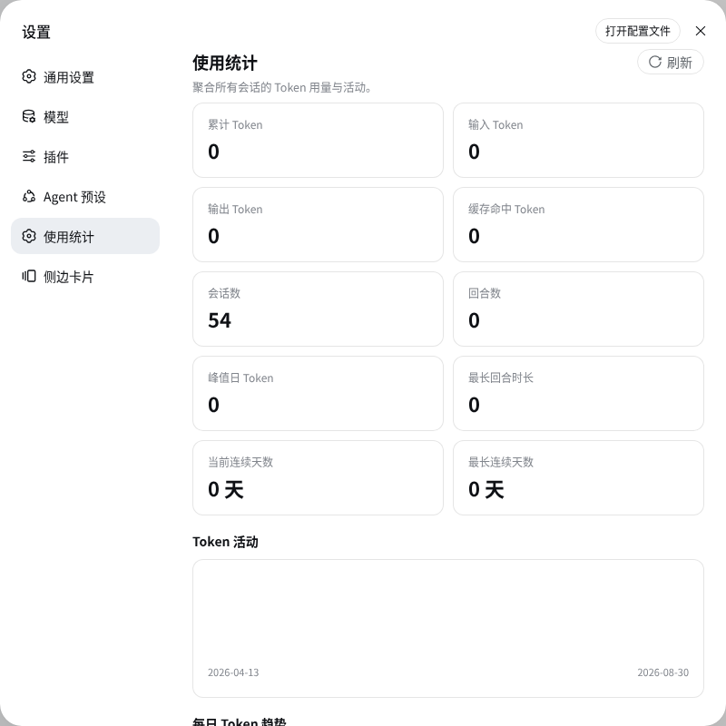

# dsh-plugin-usage-stats

English | [简体中文](README_CN.md)

[](LICENSE)

A [DeepSeek Harness](https://github.com/deepseek-harness) plugin that adds a **Usage Statistics** section to the Web settings sidebar: token totals, a 365-day activity heatmap, a 30-day input/output trend, and per-model share — all aggregated from your local session logs.



## Features

- **Key metrics at a glance** — total / input / output / cache-hit tokens, sessions, turns, peak-day tokens, longest turn, current & longest activity streaks.
- **365-day activity heatmap** (contribution-graph style) of daily token usage.
- **30-day daily token trend** — smoothed input vs. output lines with soft area fills.
- **Per-model usage** — donut chart with a provider / model dimension toggle.
- **Bilingual UI** — English and 简体中文, following the Web GUI language.
- **Zero dependencies** — every chart is hand-rolled inline SVG; no chart library, no cross-package imports.
- **Local only** — statistics are computed from local session logs and served by your local Web server. No telemetry, no network calls.

## How it works

The plugin has two halves:

- **Server half (`index.js`)** aggregates every persisted session log into totals, per-day buckets, and per-model buckets, served at `GET /api/usage-stats/summary`. The aggregate is seeded lazily by the first request (a bounded-concurrency background scan), then every live `session/event` folds in incrementally — startup is never slowed, the endpoint answers instantly, and no full re-scan ever runs again.
- **Client half (`client.js`)** registers a `settings.section` entry and renders the page — summary cards, the heatmap, the trend line, and the donut — as pure inline SVG.

## Requirements

- The `dsh` CLI with the Web profile (DeepSeek Harness).
- [pnpm](https://pnpm.io) — `dsh plugin` forwards to pnpm to manage profile dependencies.

## Install

Install into the `web` profile straight from GitHub:

```sh
dsh plugin --profile web add github:kolawong/dsh-plugin-usage-stats
dsh web
```

Then open the Web GUI and go to **Settings → Usage statistics**.

This plugin is plain JavaScript with no build step, so a git install works directly — no `pnpm allowBuilds` entry is needed. To install from a local checkout instead:

```sh
dsh plugin --profile web add ./dsh-plugin-usage-stats
```

Verify the layer is active, then boot:

```sh
dsh --profile web --dump-config   # shows the "# == dsh-plugin-usage-stats" layer
dsh web
```

Uninstall:

```sh
dsh plugin --profile web remove dsh-plugin-usage-stats
```

## Configuration

| Option | Type | Default | Description |
|---|---|---|---|
| `enabled` | boolean | `true` | Master switch for the section and the endpoint. |

You can override the plugin row in the profile's own patch layer (`$DSH_HOME/profiles/web/cordis.patch.yml`, default `~/.dsh/profiles/web/cordis.patch.yml`). A later layer replaces the whole row, so restate every key:

```yaml
- insert:
    - id: usage-stats
      name: 'dsh-plugin-usage-stats'
      inject:
        - webServer
        - sessionQuery
      config:
        enabled: false
```

## API

`GET /api/usage-stats/summary` returns the aggregate:

```jsonc
{
  "totals": {
    "inputTokens": 12000000, "outputTokens": 3400000, "totalTokens": 15900000,
    "cacheReadTokens": 500000, "sessions": 42, "turns": 318, "steps": 1900, "llmMs": 5400000
  },
  "byDay": { "2025-08-29": { "inputTokens": 1000, "outputTokens": 500, "totalTokens": 1500 } },
  "byModel": { "ark/deepseek-v4-flash": { "inputTokens": 800, "outputTokens": 400, "totalTokens": 1200 } },
  "longestTurnMs": 90000,
  "streak": { "current": 3, "longest": 17 }
}
```

While the first aggregation is still running, the endpoint answers `{"computing":true}` and the page polls until the summary is ready.

## Development

No build step — plain ESM JavaScript. Layout:

| File | Role |
|---|---|
| `index.js` | Server half: aggregation + HTTP endpoint. |
| `client.js` | Client half: the settings-section UI (inline SVG charts). |
| `index.d.ts` | Public type declarations for the server half. |
| `cordis.patch.yml` | The bundle layer that inserts the plugin. |
| `scripts/smoke.mjs` | Offline smoke test for the server half. |
| `scripts/client-smoke.mjs` | Offline smoke test for the client half (stubbed React + module table). |

Run the tests:

```sh
npm test              # both halves
npm run smoke         # server half only
npm run smoke:client  # client half only
```

## License

[MIT](LICENSE) © kola
